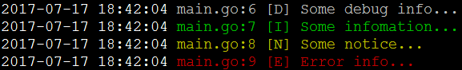

# zlog —— 基于go语言的日志模块



## 一、基本功能
1. 可以输出从`Debug`到`Error`等不同级别的日志内容；
2. 在控制台输出日志时，不同级别日志颜色不同；
3. 可以自动将日志保存为文件；
4. 日志文件可以按天存储；

## 二、安装
* 命令行下输入如下代码：
```
go get github.com/15125505/zlog/log
```
* 如果已经安装过，希望升级zlog版本，那么在命令行输入：
```
go get -u github.com/15125505/zlog/log
```


## 三、使用

### 1、简易用法
* 如果你仅仅希望拥有炫酷的控制台日志，那么可以直接如下使用：
``` go
package main

import "github.com/15125505/zlog/log"

func main() {
	log.Debug("Some debug info...")
	log.Info("Some infomation...")
	log.Notice("Some notice...")
	log.Error("Error info...")
}

``` 

### 2、写日志文件
* 如果希望在控制台输出之余，需要同时将日志写入文件，仅仅需要进行如下设置即可：
``` go
package main

import "github.com/15125505/zlog/log"

func main() {
	log.Log.SetLogFile("logs/filename") // 加入这行代码，就可以写日志文件了
	log.Debug("Some debug info...")
	log.Info("Some infomation...")
	log.Notice("Some notice...")
	log.Error("Error info...")
}
```
* 进行如上的设置后，正常输出日志，日志文件将会自动存放在**logs**目录下，日志文件示例：`logs/filename-20160922.log`
* 注意：如果设定的日志文件目录不存在，该目录将会被自动创建。

### 3、定义自己的日志模块
* 前面的例子中，直接使用了log模块中定义的一个全局的`log`对象，也就是`log.Log`，如果希望使用自己的日志对象，可以按照如下方式使用：
``` go
package main

import "github.com/15125505/zlog/log"

func main() {
	l := log.NewLogger()
	l.SetLogFile("logs/filename")
	l.Debug("Some debug info...")
	l.Info("Some infomation...")
	l.Notice("Some notice...")
	l.Error("Error info...")
}
```

### 4、日志方面高级功能
* 日志文件中默认只记录`LevelInformational`以及更高级别的日志到文件中，`Debug`级别默认不记录到文件中，如果要修改默认行为，可以进行类似下面的设置：
``` go
log.Log.SetLogLevel(log.LevelDebug)     // 设置所有的日志都记录到文件
log.Log.SetLogLevel(log.LevelNotice)    // 设置只有Notice及以上级别的日志到文件
```
* 日志文件默认按照日期命名，如果不希望按照日期分文件，那么进行如下设置即可（以默认的全局日志对象为例）：
``` go
log.Log.SetFileDaily(false)
```
* 设置日志文件之后，默认情况下，日志同时会在控制台进行输出，如果希望禁止控制台输出，可以如下设置（以默认的全局日志对象为例）：
``` go
log.Log.SetConsoleOut(false)
```
* 虽然日志文件是纯文本，是没有颜色的，不过我们可以让日志在控制台上显示输出（比如使用tail或者cat等命令）的时候，带上颜色。那么如果你希望日志文件带颜色标记，那么，只需要如下设置即可（以默认的全局日志对象为例）：
``` go
log.Log.SetFileColor(true)
```
* 某些情况下，你可能需要`Error`级别的日志额外再存储一份文件，那么进行如下设置即可（以默认的全局日志对象为例）：
``` go
log.Log.SetAdditionalErrorFile(true)
```
* 默认情况下，写日志是同步进行的，也就是说，日志写入文件成功（或者失败）之后，日志写入函数才会返回。如果希望异步写入日志文件，可以如下设置（以默认的全局日志对象为例）：
``` go
log.Log.SetWriteFileMode(true)
```
* 某些情况下，可能需要对本日志模块进行进一步的封装，如果对本日志模块进行了进一步的封装，那么为了正确输出调用日志的位置，需要使用`SetCallLevel`设置回调层次。
* 下面是一个进行封装了的示例：
``` go
package main

import (
	"github.com/15125505/zlog/log"
)

var l *log.ZLogger = log.NewLogger()

func myDebug(v ...interface{}) {
	l.Debug(v ...)
}

func myInfo(v ...interface{}) {
	l.Info(v ...)
}

func myNotice(v ...interface{}) {
	l.Notice(v ...)
}

func myError(v ...interface{}) {
	l.Error(v ...)
}

func main() {
	l.SetCallLevel(3) // 如果没有这句代码，那么日志输出的时候，显示的日志输出的文件行号将会不正确
	myDebug("Some debug info...")
	myInfo("Some infomation...")
	myNotice("Some notice...")
	myError("Error info...")
}
```

